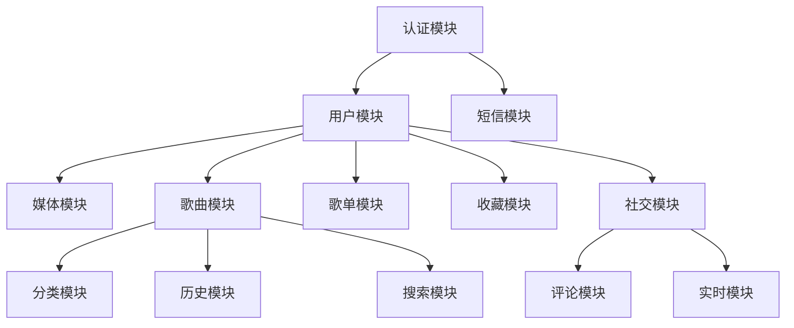

# 🔌 后端API文档

**API版本**: v1.0  
**基础URL**: `http://localhost:3000/api`  
**Swagger文档**: `http://localhost:3000/api/docs`  
**更新日期**: 2025-06-27

---

## 📋 API概览

本文档描述了音乐应用后端API的所有接口，包括认证、音乐管理、用户管理、社交功能等模块。

### 🔑 认证方式

API使用JWT (JSON Web Token) 进行身份认证：

```http
Authorization: Bearer <your-jwt-token>
```

### 📊 响应格式

所有API响应都遵循统一的格式：

```json
{
  "success": true,
  "data": {},
  "message": "操作成功",
  "timestamp": "2025-06-27T10:00:00.000Z"
}
```

### ❌ 错误响应

```json
{
  "success": false,
  "error": {
    "code": "ERROR_CODE",
    "message": "错误描述",
    "details": {}
  },
  "timestamp": "2025-06-27T10:00:00.000Z"
}
```

---

## 📁 API模块结构

本API按照功能模块进行组织，每个模块负责特定的业务功能：

| 模块 | 路径前缀 | 描述 | 主要功能 |
|------|----------|------|----------|
| 🔐 **认证模块** | `/auth` | 用户认证授权 | 注册、登录、JWT管理、密码重置 |
| 👤 **用户模块** | `/users` | 用户管理 | 用户档案、偏好设置、隐私控制 |
| 📁 **媒体模块** | `/upload`, `/download` | 媒体处理 | 文件上传下载、格式转换、存储管理 |
| 🎵 **歌曲模块** | `/songs` | 歌曲数据 | 歌曲信息、搜索、播放、元数据 |
| 📋 **歌单模块** | `/playlists` | 歌单管理 | 创建、编辑、分享歌单 |
| ❤️ **收藏模块** | `/favorites` | 收藏管理 | 收藏歌曲、歌单、分类管理 |
| 🎭 **分类模块** | `/genres` | 音乐分类 | 音乐类型、分类浏览 |
| 📊 **历史模块** | `/history` | 播放历史 | 播放记录、统计分析 |
| 🔍 **搜索模块** | `/search-history` | 搜索历史 | 搜索记录、热门搜索 |
| 👥 **社交模块** | `/social` | 社交功能 | 关注、动态、互动 |
| 💬 **评论模块** | `/comments` | 评论系统 | 评论、回复、点赞 |
| 🔄 **实时模块** | `/realtime` | 实时通信 | WebSocket、消息推送 |
| 📱 **短信模块** | `/sms` | 短信服务 | 验证码发送、短信通知 |

### 🔗 模块依赖关系



---

## 🔐 认证模块 (Auth)

### 用户注册

**POST** `/auth/register`

注册新用户账户，支持手机号和用户名两种方式。

**请求体**:
```json
{
  "registerType": "phone", // "phone" | "username"
  "phone": "13800138000",
  "smsCode": "123456",
  "username": "testuser",
  "password": "password123",
  "confirmPassword": "password123"
}
```

**响应**:
```json
{
  "success": true,
  "data": {
    "token": "eyJhbGciOiJIUzI1NiIsInR5cCI6IkpXVCJ9...",
    "refreshToken": "eyJhbGciOiJIUzI1NiIsInR5cCI6IkpXVCJ9...",
    "user": {
      "id": "uuid",
      "phone": "13800138000",
      "username": "testuser",
      "avatar": null,
      "isActive": true,
      "createdAt": "2025-06-27T10:00:00.000Z"
    }
  },
  "message": "注册成功"
}
```

### 用户登录

**POST** `/auth/login`

用户登录，支持手机号验证码和用户名密码两种方式。

**请求体**:
```json
{
  "loginType": "phone", // "phone" | "username"
  "phone": "13800138000",
  "smsCode": "123456",
  "username": "testuser",
  "password": "password123"
}
```

### 获取用户档案

**GET** `/auth/profile`

🔒 **需要认证**

获取当前用户的详细档案信息。

**响应**:
```json
{
  "success": true,
  "data": {
    "id": "uuid",
    "phone": "13800138000",
    "username": "testuser",
    "avatar": "https://example.com/avatar.jpg",
    "isActive": true,
    "greeting": "早上好",
    "subGreeting": "今天想听什么音乐呢？",
    "createdAt": "2025-06-27T10:00:00.000Z",
    "updatedAt": "2025-06-27T10:00:00.000Z"
  }
}
```

### 更新用户档案

**PUT** `/auth/profile`

🔒 **需要认证**

更新用户档案信息。

**请求体**:
```json
{
  "username": "newusername",
  "avatar": "https://example.com/new-avatar.jpg"
}
```

### 修改密码

**PUT** `/auth/change-password`

🔒 **需要认证**

修改用户密码。

**请求体**:
```json
{
  "currentPassword": "oldpassword",
  "newPassword": "newpassword",
  "confirmPassword": "newpassword"
}
```

### 刷新令牌

**POST** `/auth/refresh`

使用刷新令牌获取新的访问令牌。

**请求体**:
```json
{
  "refreshToken": "eyJhbGciOiJIUzI1NiIsInR5cCI6IkpXVCJ9..."
}
```

### 发送短信验证码

**POST** `/auth/send-sms`

发送短信验证码到指定手机号。

**请求体**:
```json
{
  "phone": "13800138000",
  "type": "login" // "login" | "register" | "reset"
}
```

---

## 👤 用户模块 (Users)

### 获取用户档案

**GET** `/users/profile`

🔒 **需要认证**

获取当前用户的档案信息。

**响应**:
```json
{
  "success": true,
  "data": {
    "id": "uuid",
    "username": "testuser",
    "phone": "13800138000",
    "email": "user@example.com",
    "avatar": "https://example.com/avatar.jpg",
    "bio": "音乐爱好者",
    "isActive": true,
    "createdAt": "2025-06-27T10:00:00.000Z",
    "updatedAt": "2025-06-27T10:00:00.000Z"
  }
}
```

### 更新用户档案

**PUT** `/users/profile`

🔒 **需要认证**

更新用户档案信息。

**请求体**:
```json
{
  "username": "newusername",
  "email": "newemail@example.com",
  "avatar": "https://example.com/new-avatar.jpg",
  "bio": "更新的个人简介"
}
```

### 用户偏好设置

**GET** `/users/preferences`

🔒 **需要认证**

获取用户偏好设置。

**POST** `/users/preferences`

🔒 **需要认证**

更新用户偏好设置。

**请求体**:
```json
{
  "key": "theme",
  "value": "dark",
  "category": "appearance"
}
```

---

## 📁 媒体模块 (Media)

### 文件上传

**POST** `/upload`

🔒 **需要认证**

上传音乐文件或图片文件。

**请求**: `multipart/form-data`
- `file`: 文件 (必需)
- `type`: 文件类型 (`audio` | `image`)
- `category`: 文件分类 (可选)

**响应**:
```json
{
  "success": true,
  "data": {
    "id": "uuid",
    "filename": "song.mp3",
    "originalName": "我的歌曲.mp3",
    "mimeType": "audio/mpeg",
    "size": 5242880,
    "url": "https://example.com/uploads/song.mp3",
    "uploadedAt": "2025-06-27T10:00:00.000Z"
  }
}
```

### 创建下载任务

**POST** `/download`

🔒 **需要认证**

创建音乐下载任务。

**请求体**:
```json
{
  "songId": "uuid",
  "quality": "high" // "low" | "medium" | "high" | "lossless"
}
```

**响应**:
```json
{
  "success": true,
  "data": {
    "id": "uuid",
    "songId": "uuid",
    "status": "pending",
    "progress": 0,
    "quality": "high",
    "estimatedSize": 5242880,
    "createdAt": "2025-06-27T10:00:00.000Z"
  }
}
```

### 获取下载列表

**GET** `/download`

🔒 **需要认证**

获取用户的下载任务列表。

**查询参数**:
- `status`: 下载状态 (`pending` | `downloading` | `completed` | `failed`)
- `page`: 页码 (默认: 1)
- `limit`: 每页数量 (默认: 20)

### 下载控制

**PUT** `/download/{id}/pause`

🔒 **需要认证**

暂停下载任务。

**PUT** `/download/{id}/resume`

🔒 **需要认证**

恢复下载任务。

**PUT** `/download/{id}/retry`

🔒 **需要认证**

重试失败的下载任务。

---

## 🎵 歌曲模块 (Songs)

### 获取歌曲列表

**GET** `/songs`

获取歌曲列表，支持分页和筛选。

**查询参数**:
- `page`: 页码 (默认: 1)
- `limit`: 每页数量 (默认: 20)
- `genre`: 音乐类型筛选
- `artist`: 艺术家筛选
- `search`: 搜索关键词
- `sort`: 排序方式 (`latest`, `popular`, `title`)

**响应**:
```json
{
  "success": true,
  "data": [
    {
      "id": "uuid",
      "title": "歌曲标题",
      "artist": "艺术家",
      "album": "专辑名称",
      "duration": 240,
      "coverUrl": "https://example.com/cover.jpg",
      "audioUrl": "https://example.com/audio.mp3",
      "genre": "流行",
      "year": 2024,
      "playCount": 1000,
      "createdAt": "2025-06-27T10:00:00.000Z"
    }
  ],
  "pagination": {
    "page": 1,
    "limit": 20,
    "total": 100,
    "totalPages": 5
  }
}
```

### 获取歌曲详情

**GET** `/songs/{id}`

根据ID获取歌曲的详细信息。

**路径参数**:
- `id`: 歌曲UUID

**响应**:
```json
{
  "success": true,
  "data": {
    "id": "uuid",
    "title": "歌曲标题",
    "artist": "艺术家",
    "album": "专辑名称",
    "duration": 240,
    "coverUrl": "https://example.com/cover.jpg",
    "audioUrl": "https://example.com/audio.mp3",
    "genre": "流行",
    "year": 2024,
    "playCount": 1000,
    "lyrics": "歌词内容...",
    "fileSize": 5242880,
    "originalFileName": "song.mp3",
    "createdAt": "2025-06-27T10:00:00.000Z",
    "updatedAt": "2025-06-27T10:00:00.000Z"
  }
}
```

### 搜索歌曲

**GET** `/songs/search`

搜索歌曲，支持标题、艺术家、专辑搜索。

**查询参数**:
- `q`: 搜索关键词 (必需)
- `page`: 页码 (默认: 1)
- `limit`: 每页数量 (默认: 20)

### 获取热门歌曲

**GET** `/songs/popular`

获取热门歌曲列表。

**查询参数**:
- `limit`: 返回数量 (默认: 50)
- `period`: 时间范围 (`day`, `week`, `month`, `all`)

### 获取最新歌曲

**GET** `/songs/latest`

获取最新上传的歌曲。

**查询参数**:
- `limit`: 返回数量 (默认: 20)

### 增加播放次数

**POST** `/songs/{id}/play`

🔒 **需要认证**

记录歌曲播放，增加播放次数。

**路径参数**:
- `id`: 歌曲UUID

---

## 📝 歌单模块 (Playlists)

### 创建歌单

**POST** `/playlists`

🔒 **需要认证**

创建新的歌单。

**请求体**:
```json
{
  "name": "我的歌单",
  "description": "歌单描述",
  "coverUrl": "https://example.com/cover.jpg",
  "isPrivate": false
}
```

### 获取歌单列表

**GET** `/playlists`

获取歌单列表，支持分页和筛选。

**查询参数**:
- `page`: 页码 (默认: 1)
- `limit`: 每页数量 (默认: 20)
- `userId`: 用户ID筛选
- `isPrivate`: 是否私有

### 获取用户歌单

**GET** `/playlists/user`

🔒 **需要认证**

获取当前用户的所有歌单。

### 获取歌单详情

**GET** `/playlists/{id}`

根据ID获取歌单详情，包含歌曲列表。

**路径参数**:
- `id`: 歌单UUID

**响应**:
```json
{
  "success": true,
  "data": {
    "id": "uuid",
    "name": "我的歌单",
    "description": "歌单描述",
    "coverUrl": "https://example.com/cover.jpg",
    "isPrivate": false,
    "isDefault": false,
    "createdAt": "2025-06-27T10:00:00.000Z",
    "user": {
      "id": "uuid",
      "username": "testuser",
      "avatar": "https://example.com/avatar.jpg"
    },
    "songs": [
      {
        "id": "uuid",
        "title": "歌曲标题",
        "artist": "艺术家",
        "duration": 240,
        "coverUrl": "https://example.com/cover.jpg"
      }
    ],
    "songCount": 10
  }
}
```

### 更新歌单

**PUT** `/playlists/{id}`

🔒 **需要认证**

更新歌单信息。

### 删除歌单

**DELETE** `/playlists/{id}`

🔒 **需要认证**

删除歌单。

### 添加歌曲到歌单

**POST** `/playlists/{id}/songs`

🔒 **需要认证**

向歌单添加歌曲。

**请求体**:
```json
{
  "songId": "uuid"
}
```

### 从歌单移除歌曲

**DELETE** `/playlists/{id}/songs/{songId}`

🔒 **需要认证**

从歌单中移除指定歌曲。

---

## ❤️ 收藏模块 (Favorites)

### 添加收藏

**POST** `/favorites`

🔒 **需要认证**

收藏歌曲。

**请求体**:
```json
{
  "songId": "uuid"
}
```

### 获取收藏列表

**GET** `/favorites`

🔒 **需要认证**

获取用户的收藏歌曲列表。

**查询参数**:
- `page`: 页码 (默认: 1)
- `limit`: 每页数量 (默认: 20)

### 取消收藏

**DELETE** `/favorites/{songId}`

🔒 **需要认证**

取消收藏指定歌曲。

### 检查收藏状态

**GET** `/favorites/check/{songId}`

🔒 **需要认证**

检查歌曲是否已收藏。

---

## 🎨 音乐类型模块 (Genres)

### 获取音乐类型列表

**GET** `/genres`

获取所有音乐类型。

**响应**:
```json
{
  "success": true,
  "data": [
    {
      "id": "uuid",
      "name": "流行",
      "description": "流行音乐",
      "isActive": true,
      "songCount": 100,
      "createdAt": "2025-06-27T10:00:00.000Z"
    }
  ]
}
```

### 获取类型详情

**GET** `/genres/{id}`

根据ID获取音乐类型详情。

### 获取类型下的歌曲

**GET** `/genres/{id}/songs`

获取指定类型下的歌曲列表。

---

## 📤 文件上传模块 (Upload)

### 上传音频文件

**POST** `/upload/audio`

🔒 **需要认证**

上传音频文件。

**请求**: `multipart/form-data`
- `file`: 音频文件 (必需)
- `title`: 歌曲标题
- `artist`: 艺术家
- `album`: 专辑

**响应**:
```json
{
  "success": true,
  "data": {
    "id": "uuid",
    "title": "歌曲标题",
    "artist": "艺术家",
    "audioUrl": "https://example.com/uploads/audio.mp3",
    "coverUrl": "https://example.com/uploads/cover.jpg",
    "duration": 240,
    "fileSize": 5242880
  }
}
```

### 上传图片

**POST** `/upload/image`

🔒 **需要认证**

上传图片文件（头像、封面等）。

**请求**: `multipart/form-data`
- `file`: 图片文件 (必需)
- `type`: 图片类型 (`avatar`, `cover`, `other`)

---

## 💬 评论模块 (Comments)

### 添加评论

**POST** `/comments`

🔒 **需要认证**

为歌曲添加评论。

**请求体**:
```json
{
  "songId": "uuid",
  "content": "评论内容",
  "parentId": "uuid" // 可选，回复评论时使用
}
```

### 获取评论列表

**GET** `/comments`

获取评论列表。

**查询参数**:
- `songId`: 歌曲ID (必需)
- `page`: 页码 (默认: 1)
- `limit`: 每页数量 (默认: 20)
- `sort`: 排序方式 (`latest`, `oldest`, `popular`)

### 删除评论

**DELETE** `/comments/{id}`

🔒 **需要认证**

删除评论（仅评论作者可删除）。

---

## 📊 播放历史模块 (History)

### 添加播放记录

**POST** `/history`

🔒 **需要认证**

记录歌曲播放历史。

**请求体**:
```json
{
  "songId": "uuid",
  "playDuration": 180 // 播放时长（秒）
}
```

### 获取播放历史

**GET** `/history`

🔒 **需要认证**

获取用户播放历史。

**查询参数**:
- `page`: 页码 (默认: 1)
- `limit`: 每页数量 (默认: 20)
- `startDate`: 开始日期
- `endDate`: 结束日期

### 清空播放历史

**DELETE** `/history`

🔒 **需要认证**

清空用户的播放历史记录。

---

## 🔍 搜索历史模块 (Search History)

### 添加搜索记录

**POST** `/search-history`

🔒 **需要认证**

记录用户搜索历史。

**请求体**:
```json
{
  "query": "搜索关键词",
  "resultCount": 10
}
```

### 获取搜索历史

**GET** `/search-history`

🔒 **需要认证**

获取用户搜索历史。

### 清空搜索历史

**DELETE** `/search-history`

🔒 **需要认证**

清空用户的搜索历史记录。

---

## ⚙️ 用户偏好模块 (User Preferences)

### 获取用户偏好

**GET** `/user-preferences`

🔒 **需要认证**

获取用户偏好设置。

**响应**:
```json
{
  "success": true,
  "data": {
    "id": "uuid",
    "userId": "uuid",
    "theme": "dark",
    "language": "zh-CN",
    "autoPlay": true,
    "playQuality": "high",
    "downloadQuality": "lossless",
    "notifications": {
      "newFollower": true,
      "newComment": true,
      "systemUpdate": false
    }
  }
}
```

### 更新用户偏好

**PUT** `/user-preferences`

🔒 **需要认证**

更新用户偏好设置。

---

## 👥 社交功能模块 (Social)

### 关注用户

**POST** `/social/follow`

🔒 **需要认证**

关注其他用户。

**请求体**:
```json
{
  "userId": "uuid"
}
```

### 取消关注

**DELETE** `/social/follow/{userId}`

🔒 **需要认证**

取消关注用户。

### 获取关注列表

**GET** `/social/following`

🔒 **需要认证**

获取用户关注的人列表。

### 获取粉丝列表

**GET** `/social/followers`

🔒 **需要认证**

获取用户的粉丝列表。

### 发布动态

**POST** `/social/feeds`

🔒 **需要认证**

发布用户动态。

**请求体**:
```json
{
  "content": "动态内容",
  "type": "text", // "text" | "music" | "playlist"
  "relatedId": "uuid" // 相关歌曲或歌单ID
}
```

### 获取动态列表

**GET** `/social/feeds`

🔒 **需要认证**

获取关注用户的动态列表。

### 点赞动态

**POST** `/social/feeds/{id}/like`

🔒 **需要认证**

为动态点赞。

### 评论动态

**POST** `/social/feeds/{id}/comments`

🔒 **需要认证**

评论动态。

---

## 📥 下载模块 (Download)

### 创建下载任务

**POST** `/download`

🔒 **需要认证**

创建音乐下载任务。

**请求体**:
```json
{
  "songId": "uuid",
  "quality": "high" // "low" | "medium" | "high" | "lossless"
}
```

### 获取下载列表

**GET** `/download`

🔒 **需要认证**

获取用户的下载任务列表。

### 获取存储信息

**GET** `/download/storage`

🔒 **需要认证**

获取用户存储空间信息。

**响应**:
```json
{
  "success": true,
  "data": {
    "totalSpace": 1073741824, // 1GB
    "usedSpace": 536870912,   // 512MB
    "availableSpace": 536870912,
    "usagePercentage": 50.0,
    "downloadCount": 25
  }
}
```

### 删除下载

**DELETE** `/download/{id}`

🔒 **需要认证**

删除下载的音乐文件。

---

## 🔧 系统接口

### 健康检查

**GET** `/health`

检查服务健康状态。

**响应**:
```json
{
  "status": "ok",
  "timestamp": "2025-06-27T10:00:00.000Z",
  "uptime": 3600,
  "environment": "development",
  "version": "1.0.0"
}
```

### 获取CSRF令牌

**GET** `/csrf-token`

获取CSRF防护令牌。

**响应**:
```json
{
  "csrfToken": "csrf-token-string"
}
```

---

## 📝 状态码说明

| 状态码 | 说明 |
|--------|------|
| 200 | 请求成功 |
| 201 | 创建成功 |
| 400 | 请求参数错误 |
| 401 | 未授权，需要登录 |
| 403 | 禁止访问，权限不足 |
| 404 | 资源不存在 |
| 409 | 资源冲突 |
| 422 | 请求参数验证失败 |
| 429 | 请求过于频繁 |
| 500 | 服务器内部错误 |

---

## 🔄 实时通信 (WebSocket)

### 连接地址

```
ws://localhost:3000/socket.io/
```

### 认证

连接时需要提供JWT令牌：

```javascript
const socket = io('http://localhost:3000', {
  auth: {
    token: 'your-jwt-token'
  }
});
```

### 事件列表

#### 客户端发送事件

- `join-room`: 加入房间
- `leave-room`: 离开房间
- `send-message`: 发送消息

#### 服务端推送事件

- `notification`: 系统通知
- `new-follower`: 新粉丝通知
- `new-comment`: 新评论通知
- `user-online`: 用户上线
- `user-offline`: 用户下线

---

*本文档持续更新中，如有疑问请参考Swagger在线文档或联系开发团队。*
