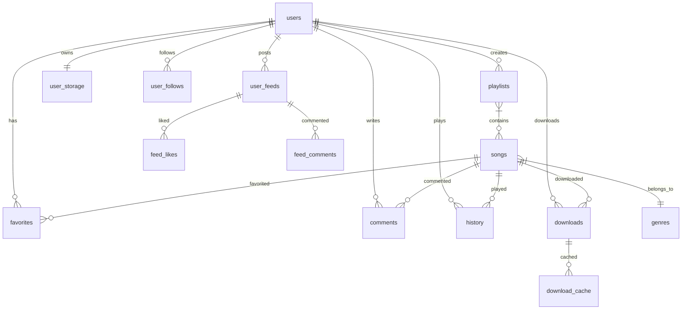

# 🗄️ 数据库设计文档

**数据库类型**: MySQL 8.0+  
**ORM框架**: TypeORM  
**字符集**: UTF8MB4  
**时区**: +08:00  
**更新日期**: 2025-06-27

---

## 📋 数据库概览

音乐应用数据库采用关系型设计，包含15个核心表，支持用户管理、音乐播放、社交功能、离线下载等完整功能。

### 🏗️ 数据库架构

```
┌─────────────────┐    ┌─────────────────┐    ┌─────────────────┐
│   用户相关表    │    │   音乐相关表    │    │   社交相关表    │
│                 │    │                 │    │                 │
│ • users         │    │ • songs         │    │ • user_follows  │
│ • user_storage  │    │ • playlists     │    │ • user_feeds    │
│ • user_prefs    │    │ • genres        │    │ • feed_likes    │
│ • history       │    │ • favorites     │    │ • feed_comments │
│ • search_hist   │    │ • comments      │    │                 │
└─────────────────┘    └─────────────────┘    └─────────────────┘
                                │
                    ┌─────────────────┐
                    │   下载相关表    │
                    │                 │
                    │ • downloads     │
                    │ • download_cache│
                    │ • charts        │
                    └─────────────────┘
```

---

## 📊 核心数据表

### 1. 用户表 (users)

用户基础信息表，支持手机号和用户名两种注册方式。

| 字段名 | 类型 | 长度 | 约束 | 描述 |
|--------|------|------|------|------|
| `id` | VARCHAR | 36 | PK, UUID | 用户唯一标识 |
| `phone` | VARCHAR | 20 | UNIQUE, NULL | 手机号 |
| `username` | VARCHAR | 50 | UNIQUE, NULL | 用户名 |
| `password` | VARCHAR | 255 | NULL | 密码哈希 |
| `avatar` | VARCHAR | 500 | NULL | 头像URL |
| `isActive` | BOOLEAN | - | DEFAULT TRUE | 是否激活 |
| `resetPasswordToken` | VARCHAR | 255 | NULL | 密码重置令牌 |
| `resetPasswordExpires` | DATETIME | - | NULL | 令牌过期时间 |
| `createdAt` | DATETIME | - | NOT NULL | 创建时间 |
| `updatedAt` | DATETIME | - | NOT NULL | 更新时间 |

**索引设计**:
- PRIMARY KEY (`id`)
- UNIQUE KEY `uk_users_phone` (`phone`)
- UNIQUE KEY `uk_users_username` (`username`)
- INDEX `idx_users_active` (`isActive`)

**约束**:
- 手机号和用户名至少有一个不为空
- 密码长度至少8位（应用层验证）

### 2. 歌曲表 (songs)

音乐文件信息表，存储歌曲元数据和文件路径。

| 字段名 | 类型 | 长度 | 约束 | 描述 |
|--------|------|------|------|------|
| `id` | VARCHAR | 36 | PK, UUID | 歌曲唯一标识 |
| `title` | VARCHAR | 200 | NOT NULL | 歌曲标题 |
| `artist` | VARCHAR | 200 | NOT NULL | 艺术家 |
| `album` | VARCHAR | 200 | NOT NULL | 专辑名称 |
| `duration` | INT | - | NOT NULL | 时长（秒） |
| `coverUrl` | VARCHAR | 500 | NOT NULL | 封面图片URL |
| `audioUrl` | VARCHAR | 500 | NOT NULL | 音频文件URL |
| `genre` | VARCHAR | 100 | NULL | 音乐类型 |
| `year` | INT | - | NULL | 发行年份 |
| `playCount` | BIGINT | - | DEFAULT 0 | 播放次数 |
| `lyrics` | TEXT | - | NULL | 歌词内容 |
| `fileSize` | BIGINT | - | NULL | 文件大小（字节） |
| `originalFileName` | VARCHAR | 255 | NULL | 原始文件名 |
| `sourceId` | VARCHAR | 100 | NULL | 来源ID |
| `sourceUrl` | VARCHAR | 500 | NULL | 来源URL |
| `createdAt` | DATETIME | - | NOT NULL | 创建时间 |
| `updatedAt` | DATETIME | - | NOT NULL | 更新时间 |

**索引设计**:
- PRIMARY KEY (`id`)
- INDEX `idx_songs_title` (`title`)
- INDEX `idx_songs_artist` (`artist`)
- INDEX `idx_songs_genre` (`genre`)
- INDEX `idx_songs_playcount` (`playCount` DESC)
- INDEX `idx_songs_created` (`createdAt` DESC)
- FULLTEXT INDEX `ft_songs_search` (`title`, `artist`, `album`)

### 3. 歌单表 (playlists)

用户创建的歌单信息表。

| 字段名 | 类型 | 长度 | 约束 | 描述 |
|--------|------|------|------|------|
| `id` | VARCHAR | 36 | PK, UUID | 歌单唯一标识 |
| `name` | VARCHAR | 200 | NOT NULL | 歌单名称 |
| `description` | TEXT | - | NULL | 歌单描述 |
| `coverUrl` | VARCHAR | 500 | NULL | 封面图片URL |
| `isPrivate` | BOOLEAN | - | DEFAULT FALSE | 是否私有 |
| `isDefault` | BOOLEAN | - | DEFAULT FALSE | 是否系统默认 |
| `userId` | VARCHAR | 36 | FK, NOT NULL | 创建用户ID |
| `createdAt` | DATETIME | - | NOT NULL | 创建时间 |
| `updatedAt` | DATETIME | - | NOT NULL | 更新时间 |

**索引设计**:
- PRIMARY KEY (`id`)
- INDEX `idx_playlists_user` (`userId`)
- INDEX `idx_playlists_public` (`isPrivate`, `createdAt` DESC)
- INDEX `idx_playlists_default` (`isDefault`)

**外键约束**:
- FOREIGN KEY (`userId`) REFERENCES `users`(`id`) ON DELETE CASCADE

### 4. 歌单歌曲关联表 (playlist_songs)

歌单与歌曲的多对多关联表。

| 字段名 | 类型 | 长度 | 约束 | 描述 |
|--------|------|------|------|------|
| `playlistId` | VARCHAR | 36 | FK, NOT NULL | 歌单ID |
| `songId` | VARCHAR | 36 | FK, NOT NULL | 歌曲ID |
| `addedAt` | DATETIME | - | DEFAULT NOW() | 添加时间 |
| `sortOrder` | INT | - | DEFAULT 0 | 排序顺序 |

**索引设计**:
- PRIMARY KEY (`playlistId`, `songId`)
- INDEX `idx_playlist_songs_song` (`songId`)
- INDEX `idx_playlist_songs_order` (`playlistId`, `sortOrder`)

### 5. 音乐类型表 (genres)

音乐分类信息表。

| 字段名 | 类型 | 长度 | 约束 | 描述 |
|--------|------|------|------|------|
| `id` | VARCHAR | 36 | PK, UUID | 类型唯一标识 |
| `name` | VARCHAR | 100 | UNIQUE, NOT NULL | 类型名称 |
| `description` | TEXT | - | NULL | 类型描述 |
| `color` | VARCHAR | 7 | NULL | 显示颜色 |
| `icon` | VARCHAR | 100 | NULL | 图标名称 |
| `isActive` | BOOLEAN | - | DEFAULT TRUE | 是否激活 |
| `sortOrder` | INT | - | DEFAULT 0 | 排序权重 |
| `createdAt` | DATETIME | - | NOT NULL | 创建时间 |
| `updatedAt` | DATETIME | - | NOT NULL | 更新时间 |

**索引设计**:
- PRIMARY KEY (`id`)
- UNIQUE KEY `uk_genres_name` (`name`)
- INDEX `idx_genres_active_sort` (`isActive`, `sortOrder`)

### 6. 收藏表 (favorites)

用户收藏歌曲记录表。

| 字段名 | 类型 | 长度 | 约束 | 描述 |
|--------|------|------|------|------|
| `id` | VARCHAR | 36 | PK, UUID | 收藏记录ID |
| `userId` | VARCHAR | 36 | FK, NOT NULL | 用户ID |
| `songId` | VARCHAR | 36 | FK, NOT NULL | 歌曲ID |
| `createdAt` | DATETIME | - | NOT NULL | 收藏时间 |

**索引设计**:
- PRIMARY KEY (`id`)
- UNIQUE KEY `uk_favorites_user_song` (`userId`, `songId`)
- INDEX `idx_favorites_song` (`songId`)
- INDEX `idx_favorites_created` (`createdAt` DESC)

### 7. 评论表 (comments)

歌曲评论信息表。

| 字段名 | 类型 | 长度 | 约束 | 描述 |
|--------|------|------|------|------|
| `id` | VARCHAR | 36 | PK, UUID | 评论唯一标识 |
| `content` | TEXT | - | NOT NULL | 评论内容 |
| `userId` | VARCHAR | 36 | FK, NOT NULL | 评论用户ID |
| `songId` | VARCHAR | 36 | FK, NOT NULL | 歌曲ID |
| `likes` | INT | - | DEFAULT 0 | 点赞数 |
| `createdAt` | DATETIME | - | NOT NULL | 创建时间 |
| `updatedAt` | DATETIME | - | NOT NULL | 更新时间 |

**索引设计**:
- PRIMARY KEY (`id`)
- INDEX `idx_comments_song` (`songId`, `createdAt` DESC)
- INDEX `idx_comments_user` (`userId`)
- INDEX `idx_comments_likes` (`likes` DESC)

### 8. 播放历史表 (history)

用户播放历史记录表。

| 字段名 | 类型 | 长度 | 约束 | 描述 |
|--------|------|------|------|------|
| `id` | VARCHAR | 36 | PK, UUID | 历史记录ID |
| `userId` | VARCHAR | 36 | FK, NOT NULL | 用户ID |
| `songId` | VARCHAR | 36 | FK, NOT NULL | 歌曲ID |
| `playedAt` | DATETIME | - | NOT NULL | 播放时间 |
| `playDuration` | INT | - | DEFAULT 0 | 播放时长（秒） |
| `deviceInfo` | VARCHAR | 200 | NULL | 设备信息 |

**索引设计**:
- PRIMARY KEY (`id`)
- INDEX `idx_history_user_time` (`userId`, `playedAt` DESC)
- INDEX `idx_history_song` (`songId`)
- INDEX `idx_history_played` (`playedAt` DESC)

---

## 👥 社交功能表

### 9. 用户关注表 (user_follows)

用户关注关系表。

| 字段名 | 类型 | 长度 | 约束 | 描述 |
|--------|------|------|------|------|
| `id` | VARCHAR | 36 | PK, UUID | 关注记录ID |
| `followerId` | VARCHAR | 36 | FK, NOT NULL | 关注者ID |
| `followingId` | VARCHAR | 36 | FK, NOT NULL | 被关注者ID |
| `createdAt` | DATETIME | - | NOT NULL | 关注时间 |

**索引设计**:
- PRIMARY KEY (`id`)
- UNIQUE KEY `uk_follows_relation` (`followerId`, `followingId`)
- INDEX `idx_follows_follower` (`followerId`)
- INDEX `idx_follows_following` (`followingId`)

### 10. 用户动态表 (user_feeds)

用户发布的动态信息表。

| 字段名 | 类型 | 长度 | 约束 | 描述 |
|--------|------|------|------|------|
| `id` | VARCHAR | 36 | PK, UUID | 动态ID |
| `userId` | VARCHAR | 36 | FK, NOT NULL | 发布用户ID |
| `content` | TEXT | - | NOT NULL | 动态内容 |
| `type` | ENUM | - | NOT NULL | 动态类型 |
| `relatedId` | VARCHAR | 36 | NULL | 关联对象ID |
| `likesCount` | INT | - | DEFAULT 0 | 点赞数 |
| `commentsCount` | INT | - | DEFAULT 0 | 评论数 |
| `isActive` | BOOLEAN | - | DEFAULT TRUE | 是否激活 |
| `createdAt` | DATETIME | - | NOT NULL | 创建时间 |
| `updatedAt` | DATETIME | - | NOT NULL | 更新时间 |

**枚举值**:
- `type`: 'text', 'music', 'playlist', 'image'

**索引设计**:
- PRIMARY KEY (`id`)
- INDEX `idx_feeds_user_time` (`userId`, `createdAt` DESC)
- INDEX `idx_feeds_type` (`type`)
- INDEX `idx_feeds_active_time` (`isActive`, `createdAt` DESC)

---

## 📥 下载功能表

### 11. 下载任务表 (downloads)

用户音乐下载任务表。

| 字段名 | 类型 | 长度 | 约束 | 描述 |
|--------|------|------|------|------|
| `id` | VARCHAR | 36 | PK, UUID | 下载任务ID |
| `userId` | VARCHAR | 36 | FK, NOT NULL | 用户ID |
| `songId` | VARCHAR | 36 | FK, NOT NULL | 歌曲ID |
| `quality` | ENUM | - | DEFAULT 'medium' | 音质等级 |
| `status` | ENUM | - | DEFAULT 'pending' | 下载状态 |
| `localPath` | VARCHAR | 500 | NULL | 本地文件路径 |
| `fileSize` | BIGINT | - | DEFAULT 0 | 文件大小 |
| `downloadedSize` | BIGINT | - | DEFAULT 0 | 已下载大小 |
| `progress` | INT | - | DEFAULT 0 | 下载进度(0-100) |
| `errorMessage` | VARCHAR | 255 | NULL | 错误信息 |
| `startedAt` | DATETIME | - | NULL | 开始时间 |
| `completedAt` | DATETIME | - | NULL | 完成时间 |
| `lastAccessedAt` | DATETIME | - | NULL | 最后访问时间 |
| `isActive` | BOOLEAN | - | DEFAULT TRUE | 是否激活 |
| `createdAt` | DATETIME | - | NOT NULL | 创建时间 |
| `updatedAt` | DATETIME | - | NOT NULL | 更新时间 |

**枚举值**:
- `quality`: 'low', 'medium', 'high', 'lossless'
- `status`: 'pending', 'downloading', 'completed', 'failed', 'paused'

**索引设计**:
- PRIMARY KEY (`id`)
- UNIQUE KEY `uk_downloads_user_song_quality` (`userId`, `songId`, `quality`)
- INDEX `idx_downloads_user` (`userId`)
- INDEX `idx_downloads_song` (`songId`)
- INDEX `idx_downloads_status` (`status`)
- INDEX `idx_downloads_created` (`createdAt` DESC)

### 12. 用户存储表 (user_storage)

用户存储空间管理表。

| 字段名 | 类型 | 长度 | 约束 | 描述 |
|--------|------|------|------|------|
| `id` | VARCHAR | 36 | PK, UUID | 存储记录ID |
| `userId` | VARCHAR | 36 | FK, UNIQUE, NOT NULL | 用户ID |
| `totalSpace` | BIGINT | - | DEFAULT 1073741824 | 总空间(字节) |
| `usedSpace` | BIGINT | - | DEFAULT 0 | 已用空间(字节) |
| `downloadCount` | INT | - | DEFAULT 0 | 下载数量 |
| `maxDownloads` | INT | - | DEFAULT 100 | 最大下载数 |
| `lastCleanupAt` | DATETIME | - | NULL | 最后清理时间 |
| `createdAt` | DATETIME | - | NOT NULL | 创建时间 |
| `updatedAt` | DATETIME | - | NOT NULL | 更新时间 |

**索引设计**:
- PRIMARY KEY (`id`)
- UNIQUE KEY `uk_storage_user` (`userId`)

---

## 🔍 其他功能表

### 13. 搜索历史表 (search_history)

用户搜索历史记录表。

| 字段名 | 类型 | 长度 | 约束 | 描述 |
|--------|------|------|------|------|
| `id` | VARCHAR | 36 | PK, UUID | 搜索记录ID |
| `userId` | VARCHAR | 36 | FK, NOT NULL | 用户ID |
| `query` | VARCHAR | 200 | NOT NULL | 搜索关键词 |
| `resultCount` | INT | - | DEFAULT 0 | 结果数量 |
| `searchedAt` | DATETIME | - | NOT NULL | 搜索时间 |

**索引设计**:
- PRIMARY KEY (`id`)
- INDEX `idx_search_user_time` (`userId`, `searchedAt` DESC)
- INDEX `idx_search_query` (`query`)

### 14. 用户偏好表 (user_preferences)

用户个性化设置表。

| 字段名 | 类型 | 长度 | 约束 | 描述 |
|--------|------|------|------|------|
| `id` | VARCHAR | 36 | PK, UUID | 偏好设置ID |
| `userId` | VARCHAR | 36 | FK, UNIQUE, NOT NULL | 用户ID |
| `theme` | VARCHAR | 20 | DEFAULT 'light' | 主题设置 |
| `language` | VARCHAR | 10 | DEFAULT 'zh-CN' | 语言设置 |
| `autoPlay` | BOOLEAN | - | DEFAULT TRUE | 自动播放 |
| `playQuality` | ENUM | - | DEFAULT 'medium' | 播放音质 |
| `downloadQuality` | ENUM | - | DEFAULT 'high' | 下载音质 |
| `notifications` | JSON | - | NULL | 通知设置 |
| `createdAt` | DATETIME | - | NOT NULL | 创建时间 |
| `updatedAt` | DATETIME | - | NOT NULL | 更新时间 |

### 15. 排行榜表 (charts)

音乐排行榜数据表。

| 字段名 | 类型 | 长度 | 约束 | 描述 |
|--------|------|------|------|------|
| `id` | VARCHAR | 36 | PK, UUID | 排行榜记录ID |
| `songId` | VARCHAR | 36 | FK, NOT NULL | 歌曲ID |
| `chartType` | VARCHAR | 50 | NOT NULL | 榜单类型 |
| `rank` | INT | - | NOT NULL | 排名 |
| `score` | DECIMAL | 10,2 | DEFAULT 0 | 评分 |
| `weekStart` | DATE | - | NOT NULL | 统计周开始 |
| `createdAt` | DATETIME | - | NOT NULL | 创建时间 |

---

## 🔗 实体关系图



---

## 📈 性能优化

### 索引策略

1. **主键索引**: 所有表使用UUID主键，确保全局唯一性
2. **外键索引**: 所有外键字段建立索引，优化关联查询
3. **复合索引**: 针对常用查询条件建立复合索引
4. **全文索引**: 歌曲表建立全文索引，支持快速搜索

### 查询优化

1. **分页查询**: 使用LIMIT和OFFSET进行分页
2. **条件过滤**: 在WHERE子句中使用索引字段
3. **关联查询**: 合理使用JOIN避免N+1查询问题
4. **缓存策略**: 热点数据使用Redis缓存

### 数据分区

1. **历史数据分区**: 按时间对history表进行分区
2. **用户数据分区**: 大用户量时可考虑按用户ID分区
3. **归档策略**: 定期归档老旧数据

---

## 🔒 数据安全

### 数据加密

1. **密码加密**: 使用BCrypt进行密码哈希
2. **敏感信息**: 手机号等敏感信息考虑加密存储
3. **传输加密**: 使用HTTPS保证传输安全

### 备份策略

1. **定期备份**: 每日全量备份，每小时增量备份
2. **异地备份**: 备份文件存储在不同地理位置
3. **恢复测试**: 定期进行备份恢复测试

### 权限控制

1. **数据库用户**: 不同环境使用不同数据库用户
2. **最小权限**: 应用只获得必要的数据库权限
3. **审计日志**: 记录重要数据操作日志

---

## 📝 维护说明

### 数据库迁移

使用TypeORM的迁移功能管理数据库结构变更：

```bash
# 生成迁移文件
npm run migration:generate -- -n MigrationName

# 运行迁移
npm run migration:run

# 回滚迁移
npm run migration:revert
```

### 数据初始化

项目提供完整的种子数据脚本：

```bash
# 初始化基础数据
npm run seed

# 清空数据库
npm run db:clear
```

### 监控指标

1. **连接数**: 监控数据库连接池使用情况
2. **查询性能**: 监控慢查询和查询执行时间
3. **存储空间**: 监控数据库存储空间使用情况
4. **索引效率**: 定期分析索引使用效率

---

*本文档随数据库结构变更持续更新，请关注最新版本。*
